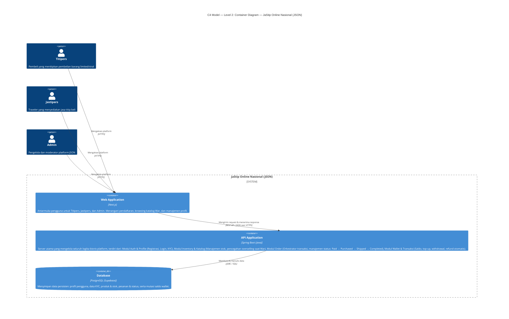
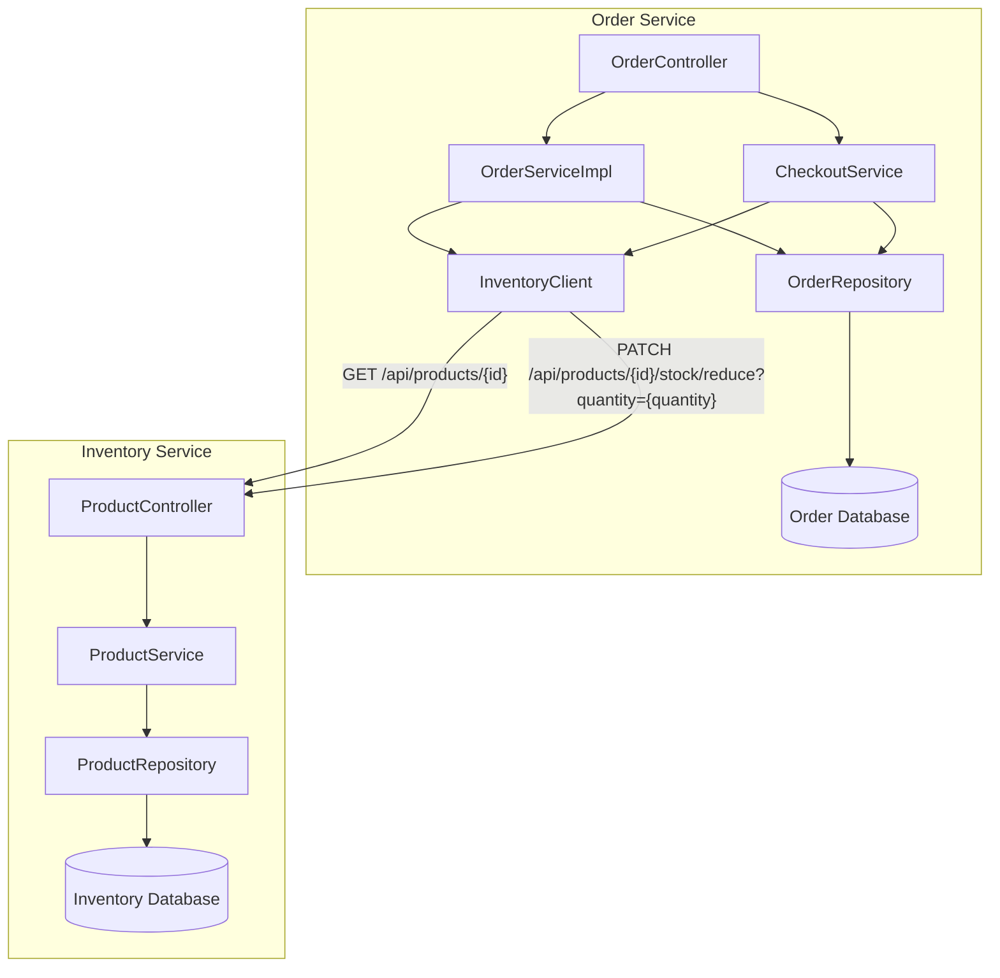
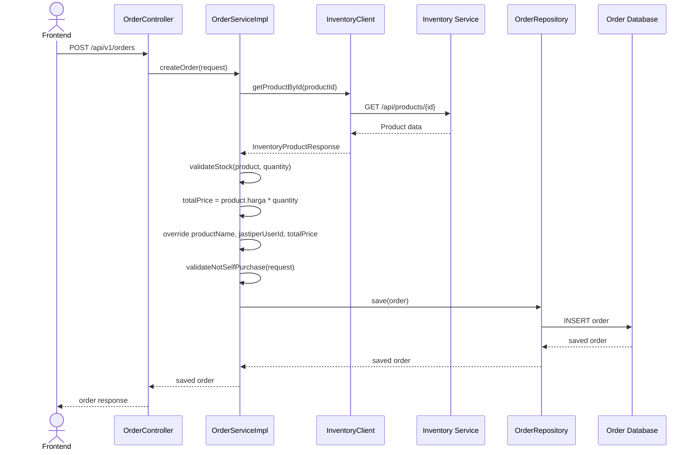
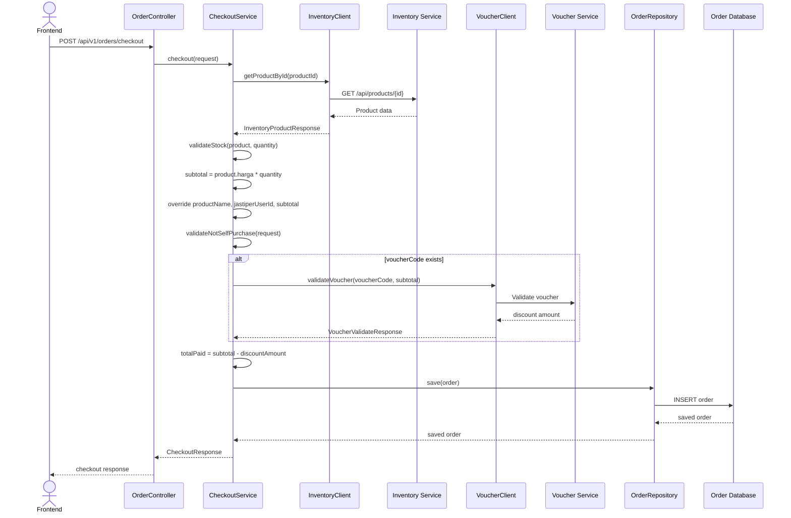
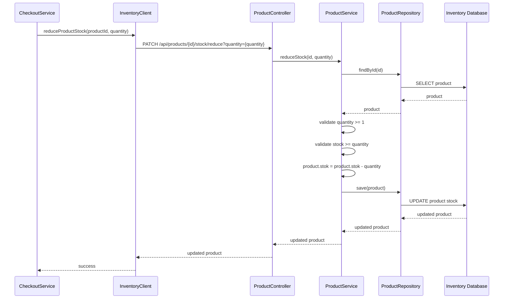
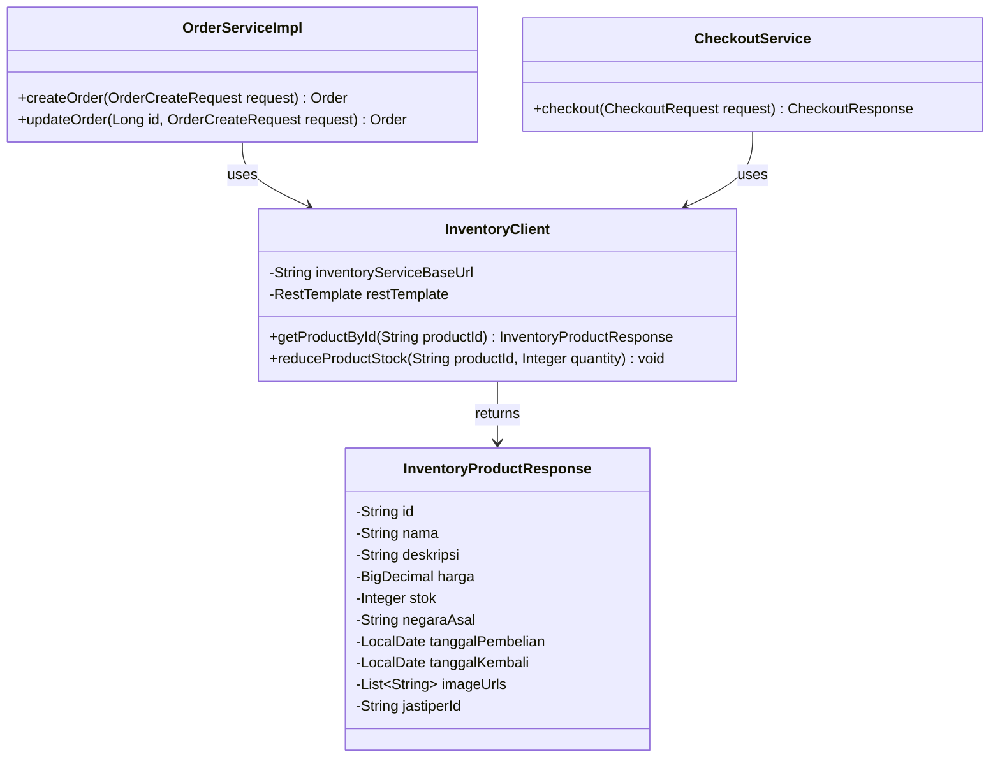

This is a [Next.js](https://nextjs.org) project bootstrapped with [`create-next-app`](https://github.com/vercel/next.js/tree/canary/packages/create-next-app).

## Getting Started

First, run the development server:

```bash
npm run dev
# or
yarn dev
# or
pnpm dev
# or
bun dev
```

Open [http://localhost:3000](http://localhost:3000) with your browser to see the result.

You can start editing the page by modifying `app/page.js`. The page auto-updates as you edit the file.

This project uses [`next/font`](https://nextjs.org/docs/app/building-your-application/optimizing/fonts) to automatically optimize and load [Geist](https://vercel.com/font), a new font family for Vercel.

## Learn More

To learn more about Next.js, take a look at the following resources:

- [Next.js Documentation](https://nextjs.org/docs) - learn about Next.js features and API.
- [Learn Next.js](https://nextjs.org/learn) - an interactive Next.js tutorial.

You can check out [the Next.js GitHub repository](https://github.com/vercel/next.js) - your feedback and contributions are welcome!

## Deploy on Vercel

The easiest way to deploy your Next.js app is to use the [Vercel Platform](https://vercel.com/new?utm_medium=default-template&filter=next.js&utm_source=create-next-app&utm_campaign=create-next-app-readme) from the creators of Next.js.

Check out our [Next.js deployment documentation](https://nextjs.org/docs/app/building-your-application/deploying) for more details.

# JaStip Online Nasional (JSON) — C4 Model: Level 2 Container Diagram

## Deskripsi Sistem

**JSON** adalah platform yang menghubungkan **Titipers** (pembeli barang limited/viral) dengan **Jastipers** (traveler yang menyediakan jasa titip). Sistem dirancang untuk menangani lonjakan traffic tinggi saat *War* (perebutan barang limited) dan menjamin keamanan transaksi keuangan melalui fitur **Wallet**.

---
## Context Diagram


## Container Diagram (Mermaid.js)


## Deplyment Diagram


---

## Penjelasan Komponen

| Container | Teknologi | Fungsi Utama |
|---|---|---|
| **Web Application** | Next.js | UI untuk semua role user — pendaftaran, katalog War, profil, dashboard admin |
| **API Application** | Spring Boot (Java) | Backend monolitik dengan 4 modul: Auth & Profile, Inventory & Katalog, Order, Wallet & Transaksi |
| **Database** | PostgreSQL (Supabase) | Penyimpanan persisten untuk seluruh entitas bisnis |

## Relasi & Protokol

| Dari | Ke | Protokol | Keterangan |
|---|---|---|---|
| Titipers / Jastipers / Admin | Web Application | HTTPS | Akses antarmuka pengguna via browser |
| Web Application | API Application | REST API / JSON over HTTPS | Komunikasi client-server |
| API Application | Database | JDBC / SQL | Query dan mutasi data persisten |

# Future Architecture of Group A3

Future architecture ini dibuat berdasarkan current architecture JSON Platform. Tujuannya adalah memperbaiki beberapa risiko pada arsitektur saat ini, terutama terkait security, scalability, reliability, deployment, dan observability.

Perubahan utama yang diusulkan adalah penambahan API Gateway, pemisahan backend menjadi beberapa microservice, database per service, message broker untuk event-driven communication, serta monitoring dan logging.

---

## Future Context Diagram


### Future Context Explanation

Pada future context diagram, JSON Platform tetap menjadi sistem utama yang digunakan oleh tiga aktor utama, yaitu Titipers, Jastipers, dan Admin. Titipers menggunakan sistem untuk mencari produk, melakukan checkout, membayar menggunakan wallet, dan melihat riwayat order. Jastipers menggunakan sistem untuk mengelola katalog, stok, order masuk, dan withdrawal saldo. Admin menggunakan sistem untuk melakukan verifikasi KYC, monitoring user, monitoring transaksi, dan penanganan dispute.

Perbedaan utama dari future context adalah penambahan external systems yang lebih jelas, seperti Payment Gateway, Email/Notification Service, Object Storage, dan Monitoring & Logging System. Penambahan ini bertujuan untuk meningkatkan reliability, security, dan maintainability sistem. Dengan pemisahan external dependencies ini, tanggung jawab JSON Platform menjadi lebih jelas dan integrasi dengan layanan eksternal dapat dikelola secara lebih terstruktur.

---

## Future Container Diagram

```mermaid
C4Container
    title C4 Model — Future Level 2: Container Diagram — JaStip Online Nasional (JSON)

    Person(titipers, "Titipers", "Pembeli yang menitipkan pembelian barang limited/viral")
    Person(jastipers, "Jastipers", "Traveler yang menyediakan jasa titip beli")
    Person(admin, "Admin", "Pengelola dan moderator platform JSON")

    System_Ext(email_service, "Email / Notification Service", "External service untuk email verifikasi, update order, dan notifikasi")
    System_Ext(payment_gateway, "Payment Gateway", "External payment provider untuk top-up, payout, dan pembayaran")
    System_Ext(object_storage, "Object Storage", "External storage untuk gambar produk dan dokumen KYC")

    System_Boundary(json_system, "JaStip Online Nasional (JSON)") {

        Container(web_app, "Web Application", "Next.js", "Antarmuka pengguna untuk Titipers, Jastipers, dan Admin")

        Container(api_gateway, "API Gateway / Reverse Proxy", "Nginx / API Gateway", "Pintu masuk utama ke backend. Menangani routing, HTTPS termination, rate limiting, dan forwarding request ke microservices")

        Container(auth_service, "Auth & Profile Service", "Spring Boot (Java)", "Mengelola registrasi, login, JWT authentication, profile user, role, KYC, dan verifikasi admin")

        Container(inventory_service, "Inventory & Catalog Service", "Spring Boot (Java)", "Mengelola katalog produk, stok, pencarian produk, validasi stok, dan pengurangan stok saat checkout")

        Container(order_service, "Order Service", "Spring Boot (Java)", "Mengelola checkout, order lifecycle, status pesanan, cancellation, dan integrasi ke Inventory, Wallet, dan Voucher")

        Container(wallet_service, "Wallet & Transaction Service", "Spring Boot (Java)", "Mengelola saldo, top-up, withdrawal, pembayaran order, refund, dan riwayat transaksi")

        Container(voucher_service, "Voucher & Promo Service", "Spring Boot (Java)", "Mengelola voucher, validasi promo, kalkulasi diskon, kuota voucher, dan voucher expiration")

        Container(message_broker, "Message Broker", "RabbitMQ / Kafka", "Mengelola event asynchronous seperti OrderCreated, PaymentCompleted, InventoryStockReduced, dan RefundRequested")

        Container(monitoring, "Monitoring & Logging", "Prometheus / Grafana / ELK", "Mengumpulkan logs, metrics, dan tracing antarservice")

        ContainerDb(auth_db, "Auth Database", "PostgreSQL (Supabase)", "Menyimpan data user, role, profile, dan KYC")

        ContainerDb(inventory_db, "Inventory Database", "PostgreSQL (Supabase)", "Menyimpan data produk, katalog, stok, dan metadata produk")

        ContainerDb(order_db, "Order Database", "PostgreSQL (Supabase)", "Menyimpan data order, status pesanan, dan histori transaksi order")

        ContainerDb(wallet_db, "Wallet Database", "PostgreSQL (Supabase)", "Menyimpan saldo, mutasi wallet, payment, withdrawal, dan refund")

        ContainerDb(voucher_db, "Voucher Database", "PostgreSQL (Supabase)", "Menyimpan data voucher, kuota, masa berlaku, dan histori penggunaan voucher")
    }

    Rel(titipers, web_app, "Mengakses platform", "HTTPS")
    Rel(jastipers, web_app, "Mengakses platform", "HTTPS")
    Rel(admin, web_app, "Mengelola platform", "HTTPS")

    Rel(web_app, api_gateway, "Mengirim request dan menerima response", "REST API / JSON over HTTPS")

    Rel(api_gateway, auth_service, "Route auth/profile requests", "REST API")
    Rel(api_gateway, inventory_service, "Route catalog/product requests", "REST API")
    Rel(api_gateway, order_service, "Route order/checkout requests", "REST API")
    Rel(api_gateway, wallet_service, "Route wallet/payment requests", "REST API")
    Rel(api_gateway, voucher_service, "Route voucher requests", "REST API")

    Rel(inventory_service, auth_service, "Validasi JWT, role Jastiper, dan ownership product", "REST API")
    Rel(order_service, inventory_service, "Fetch product detail, validasi stok, reduce stock", "REST API")
    Rel(order_service, wallet_service, "Validasi saldo, proses payment, request refund", "REST API")
    Rel(order_service, voucher_service, "Validasi voucher dan kalkulasi diskon", "REST API")
    Rel(order_service, auth_service, "Ambil data profile dan role user", "REST API")

    Rel(order_service, message_broker, "Publish order and checkout events", "Async Event")
    Rel(wallet_service, message_broker, "Publish payment and refund events", "Async Event")
    Rel(inventory_service, message_broker, "Publish inventory update events", "Async Event")
    Rel(voucher_service, message_broker, "Publish voucher usage events", "Async Event")

    Rel(auth_service, auth_db, "Membaca dan menulis data user/profile/KYC", "JDBC / SQL")
    Rel(inventory_service, inventory_db, "Membaca dan menulis data produk/stok", "JDBC / SQL")
    Rel(order_service, order_db, "Membaca dan menulis data order", "JDBC / SQL")
    Rel(wallet_service, wallet_db, "Membaca dan menulis data wallet/transaksi", "JDBC / SQL")
    Rel(voucher_service, voucher_db, "Membaca dan menulis data voucher", "JDBC / SQL")

    Rel(auth_service, email_service, "Mengirim email verifikasi dan notifikasi akun", "External API")
    Rel(wallet_service, payment_gateway, "Memproses top-up, payout, dan pembayaran", "External API")
    Rel(inventory_service, object_storage, "Menyimpan gambar produk", "External API")
    Rel(auth_service, object_storage, "Menyimpan dokumen KYC", "External API")

    Rel(auth_service, monitoring, "Mengirim logs dan metrics", "Logs / Metrics")
    Rel(inventory_service, monitoring, "Mengirim logs dan metrics", "Logs / Metrics")
    Rel(order_service, monitoring, "Mengirim logs dan metrics", "Logs / Metrics")
    Rel(wallet_service, monitoring, "Mengirim logs dan metrics", "Logs / Metrics")
    Rel(voucher_service, monitoring, "Mengirim logs dan metrics", "Logs / Metrics")

    UpdateLayoutConfig($c4ShapeInRow="3", $c4BoundaryInRow="1")
```



### Future Container Explanation

Pada future container diagram, backend tidak lagi digambarkan sebagai satu API Application besar. Sistem dipecah menjadi beberapa microservice berdasarkan bounded context, yaitu Auth & Profile Service, Inventory & Catalog Service, Order Service, Wallet & Transaction Service, dan Voucher & Promo Service. Pemisahan ini membuat tanggung jawab setiap service lebih jelas dan memudahkan proses pengembangan, testing, deployment, serta scaling.

API Gateway atau Reverse Proxy ditambahkan sebagai pintu masuk utama dari frontend ke backend. Dengan adanya API Gateway, frontend tidak perlu langsung mengetahui alamat setiap service. Gateway juga dapat digunakan untuk HTTPS termination, routing, rate limiting, dan validasi awal request. Selain itu, database dipisahkan per service agar data ownership lebih jelas dan sesuai dengan prinsip microservices.

Message Broker ditambahkan untuk mendukung komunikasi asynchronous pada proses yang rawan inkonsistensi, seperti checkout, payment, inventory stock update, voucher usage, dan refund. Monitoring & Logging juga ditambahkan agar error antarservice dapat dilacak dengan lebih mudah ketika sistem berjalan di production.

---

## Future Deployment Diagram

```mermaid
graph TB
  subgraph CLIENT["CLIENT LAYER"]
    direction LR

    TITIPERS["Titipers Browser<br/>Chrome / Safari / Firefox"]
    JASTIPER["Jastiper Browser<br/>Chrome / Safari / Firefox"]
    ADMIN["Admin Browser<br/>Desktop Browser"]
  end

  subgraph VERCEL["VERCEL PLATFORM"]
    FE["JSON Frontend<br/>Next.js<br/>HTTPS"]
  end

  subgraph EDGE["FUTURE EDGE & SECURITY LAYER"]
    GATEWAY["API Gateway / Reverse Proxy<br/>Nginx / API Gateway<br/>HTTPS Termination<br/>Rate Limiting<br/>Routing"]
  end

  subgraph AWS["AWS EC2 BACKEND SERVER"]
    direction TB

    subgraph DOCKER["Docker Containers"]
      AUTH["Auth & Profile Service<br/>Spring Boot<br/>Port 8081"]
      INVENTORY["Inventory & Catalog Service<br/>Spring Boot"]
      ORDER["Order Service<br/>Spring Boot"]
      WALLET["Wallet Service<br/>Spring Boot"]
      VOUCHER["Voucher Service<br/>Spring Boot"]
    end

    BROKER["Message Broker<br/>RabbitMQ<br/>Future async event processing"]

    MONITORING["Monitoring & Logging<br/>Future: Prometheus / Grafana / ELK"]
  end

  subgraph SUPABASE["SUPABASE POSTGRESQL"]
    AUTH_DB["Auth Database<br/>Users, Profiles, KYC"]
    INVENTORY_DB["Inventory Database<br/>Products, Stock, Catalog"]
    ORDER_DB["Order Database<br/>Orders, Status History"]
    WALLET_DB["Wallet Database<br/>Balance, Transactions, Refunds"]
    VOUCHER_DB["Voucher Database<br/>Voucher, Quota, Usage"]
  end

  subgraph EXTERNAL["FUTURE EXTERNAL SERVICES"]
    PAYMENT["Payment Gateway<br/>Midtrans / Xendit"]
    EMAIL["Email / Notification Service<br/>SendGrid / AWS SES"]
    STORAGE["Object Storage<br/>AWS S3 / GCS<br/>Product Images & KYC Documents"]
  end

  subgraph CICD["CI/CD PIPELINE"]
    GH["GitHub Repository"]
    GHA["GitHub Actions<br/>Build, Test, Deploy"]
  end

  TITIPERS -->|"HTTPS"| FE
  JASTIPER -->|"HTTPS"| FE
  ADMIN -->|"HTTPS"| FE

  FE -->|"REST API / JSON over HTTPS"| GATEWAY

  GATEWAY -->|"Route Auth Requests"| AUTH
  GATEWAY -->|"Route Inventory Requests"| INVENTORY
  GATEWAY -->|"Route Order Requests"| ORDER
  GATEWAY -->|"Route Wallet Requests"| WALLET
  GATEWAY -->|"Route Voucher Requests"| VOUCHER

  AUTH -->|"JDBC / SQL"| AUTH_DB
  INVENTORY -->|"JDBC / SQL"| INVENTORY_DB
  ORDER -->|"JDBC / SQL"| ORDER_DB
  WALLET -->|"JDBC / SQL"| WALLET_DB
  VOUCHER -->|"JDBC / SQL"| VOUCHER_DB

  INVENTORY -->|"Validate JWT / Role"| AUTH
  ORDER -->|"Fetch Product / Reduce Stock"| INVENTORY
  ORDER -->|"Payment / Refund Request"| WALLET
  ORDER -->|"Validate Voucher"| VOUCHER
  ORDER -->|"Fetch User Profile"| AUTH

  ORDER -->|"Publish Order Events"| BROKER
  WALLET -->|"Publish Payment Events"| BROKER
  INVENTORY -->|"Publish Stock Events"| BROKER
  VOUCHER -->|"Publish Voucher Events"| BROKER

  AUTH -->|"Send Verification Email"| EMAIL
  WALLET -->|"Top-up / Withdrawal / Payment"| PAYMENT
  INVENTORY -->|"Store Product Images"| STORAGE
  AUTH -->|"Store KYC Documents"| STORAGE

  AUTH -->|"Logs / Metrics"| MONITORING
  INVENTORY -->|"Logs / Metrics"| MONITORING
  ORDER -->|"Logs / Metrics"| MONITORING
  WALLET -->|"Logs / Metrics"| MONITORING
  VOUCHER -->|"Logs / Metrics"| MONITORING

  GH -->|"Push / Pull Request"| GHA
  GHA -->|"Deploy Frontend"| VERCEL
  GHA -->|"Deploy Backend Containers"| AWS
```



### Future Deployment Explanation

Pada future deployment diagram, frontend tetap dideploy di Vercel agar mudah diakses oleh pengguna melalui HTTPS. Backend services dideploy sebagai Docker containers di AWS EC2. Setiap backend service berkomunikasi dengan database PostgreSQL/Supabase masing-masing agar data tetap terpisah sesuai service ownership.

API Gateway atau Reverse Proxy ditambahkan di depan backend services untuk meningkatkan security dan maintainability. Layer ini dapat menangani HTTPS termination, routing ke service yang sesuai, rate limiting, dan menjadi titik kontrol utama untuk request yang masuk dari frontend. Dengan pendekatan ini, frontend tidak perlu langsung berkomunikasi ke setiap backend service secara terpisah.

Future deployment juga menambahkan Message Broker, Monitoring & Logging, dan external services seperti Payment Gateway, Email Service, serta Object Storage. Message Broker digunakan untuk event-driven communication, khususnya pada proses checkout, payment, inventory stock update, voucher usage, dan refund. Monitoring & Logging membantu tim mendeteksi error, latency, dan kegagalan antarservice dengan lebih cepat.

---

## Summary of Future Improvements

| Area | Current Condition | Future Improvement |
|---|---|---|
| Backend Structure | Backend digambarkan sebagai satu API Application besar | Backend dipisah menjadi beberapa microservice berdasarkan bounded context |
| API Access | Frontend berkomunikasi langsung ke backend API | Ditambahkan API Gateway / Reverse Proxy |
| Security | Beberapa service masih dapat diekspos langsung | HTTPS termination, rate limiting, dan internal service authentication |
| Data Ownership | Database masih digambarkan sebagai satu database utama | Database dipisahkan per service |
| Reliability | Komunikasi antarservice dominan synchronous REST API | Message Broker untuk event-driven communication dan retry |
| Observability | Monitoring dan logging belum tergambar jelas | Ditambahkan Monitoring & Logging |
| External Integration | External services belum tergambar jelas | Payment Gateway, Email Service, dan Object Storage ditambahkan |

# Explanation of Risk Storming of Group A3

Risk storming is applied in this project to identify architectural risks in the current JSON Platform before deciding the future architecture. Since JSON is designed as a microservice-based system with several modules such as Auth, Inventory, Order, Wallet, Voucher, and Frontend, failures may happen not only inside one service but also in the communication between services. Therefore, the team needs a structured technique to discuss risks related to security, scalability, reliability, data consistency, and deployment.

By applying risk storming, the team can analyze the current context, container, and deployment diagrams collaboratively. Each member can identify possible weak points from their own module, such as direct service exposure, lack of internal authentication, synchronous communication between services, or possible inconsistency between Order, Inventory, Wallet, and Voucher during checkout. These risks are then discussed and prioritized based on their impact on the system.

The result of risk storming is used as the basis for designing the future architecture. Instead of adding components randomly, each future improvement is connected to a specific risk. For example, API Gateway is proposed to improve security and routing, Message Broker is proposed to improve reliability and asynchronous processing, database separation is proposed to improve service ownership, and monitoring/logging is proposed to improve observability. This makes the future architecture more justified and aligned with the actual risks found in the system.

## Risk Storming Result

| No | Risk Area | Current Risk | Impact | Risk Level | Proposed Mitigation |
|---|---|---|---|---|---|
| 1 | Security | Backend services can be accessed directly without a centralized gateway | Public endpoints may be misused and access control becomes harder to manage | High | Add API Gateway / Reverse Proxy with HTTPS termination, rate limiting, routing, and centralized access control |
| 2 | Security | Internal service endpoints, such as reduce stock, may be exposed publicly | Unauthorized users may trigger sensitive internal operations | High | Add internal service authentication using service token or internal API key |
| 3 | Reliability | Order, Inventory, Wallet, and Voucher communicate mostly using synchronous REST calls | If one service is down, checkout flow can fail or become inconsistent | High | Add Message Broker for asynchronous event-driven communication and retry mechanism |
| 4 | Data Consistency | Checkout involves multiple services such as Order, Inventory, Wallet, and Voucher | Order may be created while stock, payment, or voucher state is not updated correctly | High | Use event-driven flow, retry mechanism, and compensating transaction / saga pattern |
| 5 | Scalability | Backend services may run on limited EC2 instances | High traffic during war or flash sale can cause bottlenecks | Medium | Add load balancing, horizontal scaling, and separate scaling per microservice |
| 6 | Observability | Logging and monitoring are not centralized | Failures between services are difficult to trace and debug | Medium | Add centralized monitoring, logging, and tracing using tools such as Prometheus, Grafana, or ELK |
| 7 | Deployment | Frontend may be deployed on HTTPS while backend services are still accessed through HTTP | Browser may block requests due to mixed content and communication is less secure | High | Add HTTPS support through API Gateway or Reverse Proxy |
| 8 | Data Ownership | Current architecture may still be interpreted as using one shared database | Service boundaries become unclear and changes in one module may affect others | Medium | Separate database per service based on bounded context |

## Conclusion

Risk storming helps the team understand the weaknesses of the current architecture and connect them directly to concrete improvements in the future architecture. The technique is useful because the JSON Platform consists of multiple interconnected services, where architectural risks can appear from service communication, data ownership, deployment, and security boundaries. By applying risk storming, the proposed future architecture becomes more focused, traceable, and aligned with the actual needs of the system.


# Individual Work - Anak Agung Ngurah Abhivadya Nandana

## Component Diagram - Order and Inventory Integration

Component diagram ini menjelaskan bagian yang saya kerjakan dalam integrasi antara Order Service dan Inventory Service. Integrasi ini digunakan agar Order Service tidak hanya menerima data produk dari request frontend, tetapi mengambil data resmi dari Inventory Service berdasarkan `productId`.



### Component Diagram Explanation

Pada diagram ini, `OrderServiceImpl` bertanggung jawab untuk membuat order awal, sedangkan `CheckoutService` bertanggung jawab untuk proses checkout. Keduanya menggunakan `InventoryClient` untuk berkomunikasi dengan Inventory Service.

`InventoryClient` memiliki dua tanggung jawab utama. Pertama, mengambil detail produk dari Inventory Service menggunakan endpoint `GET /api/products/{id}`. Kedua, mengurangi stok produk setelah checkout berhasil menggunakan endpoint `PATCH /api/products/{id}/stock/reduce?quantity={quantity}`.

Dengan desain ini, data penting seperti `productName`, `jastiperUserId`, `harga`, dan `stok` tidak sepenuhnya dipercaya dari request frontend. Order Service akan mengambil data tersebut dari Inventory Service agar proses order dan checkout lebih konsisten.

---

## Code Diagram 1 - Create Order Flow

Code diagram ini menjelaskan alur ketika user membuat order melalui `OrderServiceImpl`.



### Explanation

Pada flow ini, Order Service mengambil detail produk dari Inventory Service sebelum order dibuat. Setelah produk ditemukan, service melakukan validasi stok dan menghitung `totalPrice` berdasarkan harga dari Inventory dikalikan jumlah produk.

Setelah itu, field seperti `productName`, `jastiperUserId`, dan `totalPrice` di-override menggunakan data dari Inventory. Hal ini dilakukan agar frontend tidak bisa memanipulasi nama produk, pemilik produk, atau harga order.

---

## Code Diagram 2 - Checkout Flow

Code diagram ini menjelaskan alur checkout melalui `CheckoutService`.



### Explanation

Pada checkout flow, `CheckoutService` mengambil data produk dari Inventory Service, memvalidasi stok, lalu menghitung subtotal berdasarkan harga produk dari Inventory. Jika user menggunakan voucher, service akan memvalidasi voucher terlebih dahulu sebelum menghitung total pembayaran akhir.

Flow ini memastikan bahwa subtotal tidak diambil langsung dari frontend. Dengan begitu, harga checkout tetap konsisten dengan data produk yang tersimpan di Inventory Service.

---

## Code Diagram 3 - Reduce Stock Flow

Code diagram ini menjelaskan alur pengurangan stok setelah checkout berhasil.



### Explanation

Pengurangan stok dilakukan oleh Inventory Service karena stok merupakan bagian dari domain Inventory. Order Service hanya memanggil endpoint khusus `PATCH /api/products/{id}/stock/reduce?quantity={quantity}` melalui `InventoryClient`.

Di Inventory Service, `ProductService` akan mencari produk berdasarkan id, memvalidasi quantity, memastikan stok tidak kurang dari jumlah yang diminta, lalu mengurangi stok dan menyimpan perubahan ke database. Dengan cara ini, logic stok tetap berada di Inventory Service dan tidak dipindahkan ke Order Service.

---

## Code Diagram 4 - InventoryClient Responsibility

Code diagram ini menjelaskan tanggung jawab `InventoryClient` sebagai penghubung antara Order Service dan Inventory Service.



### Explanation

`InventoryClient` berperan sebagai client internal yang digunakan oleh Order Service untuk mengakses Inventory Service. Method `getProductById` digunakan untuk mengambil detail produk, sedangkan `reduceProductStock` digunakan untuk mengurangi stok setelah checkout berhasil.

Dengan memisahkan komunikasi ke Inventory Service ke dalam `InventoryClient`, logic HTTP call tidak tersebar di `OrderServiceImpl` dan `CheckoutService`. Hal ini membuat code lebih rapi, lebih mudah dirawat, dan lebih mudah diuji menggunakan mock pada unit test.

---

## Individual Work Summary

Pada individual work ini, saya berfokus pada integrasi antara Order Service dan Inventory Service. Tujuan utama integrasi ini adalah memastikan proses pembuatan order dan checkout menggunakan data produk yang valid dari Inventory Service.

Perubahan utama yang dijelaskan dalam diagram ini meliputi:

| Area | Penjelasan |
|---|---|
| Product Data Source | Order Service mengambil data produk dari Inventory Service berdasarkan `productId` |
| Price Calculation | `totalPrice` dan `subtotal` dihitung dari harga Inventory, bukan dari request frontend |
| Stock Validation | Order Service memvalidasi stok berdasarkan data dari Inventory |
| Stock Reduction | Inventory Service mengurangi stok melalui endpoint khusus setelah checkout berhasil |
| Service Boundary | Logic stok tetap berada di Inventory Service, sedangkan Order Service hanya melakukan orchestration |

Dengan pendekatan ini, integrasi antarservice menjadi lebih jelas. Order Service bertugas mengatur proses order dan checkout, sedangkan Inventory Service tetap menjadi source of truth untuk data produk dan stok.
