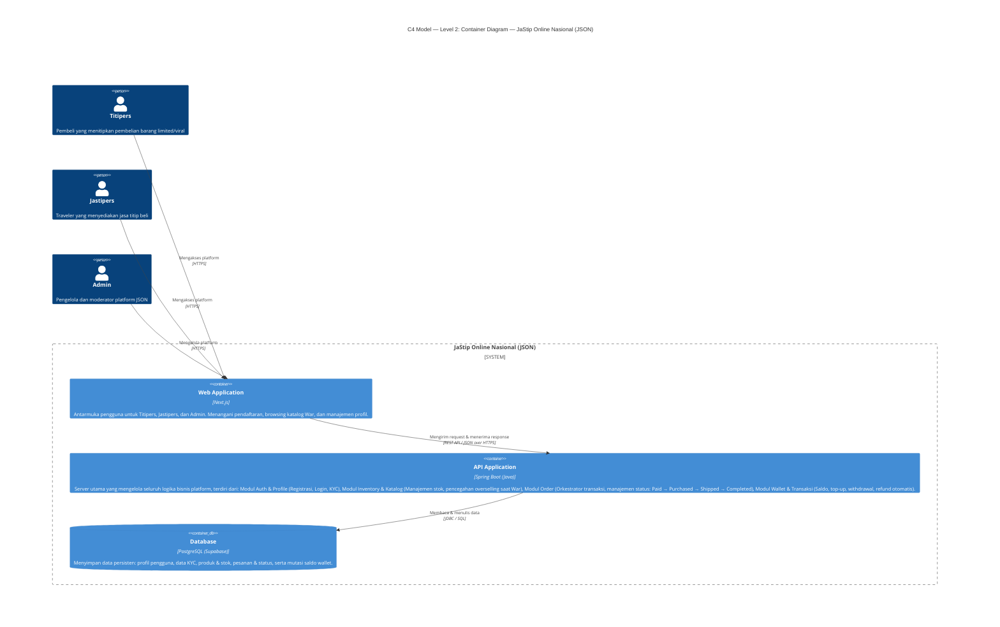

This is a [Next.js](https://nextjs.org) project bootstrapped with [`create-next-app`](https://github.com/vercel/next.js/tree/canary/packages/create-next-app).

## Getting Started

First, run the development server:

```bash
npm run dev
# or
yarn dev
# or
pnpm dev
# or
bun dev
```

Open [http://localhost:3000](http://localhost:3000) with your browser to see the result.

You can start editing the page by modifying `app/page.js`. The page auto-updates as you edit the file.

This project uses [`next/font`](https://nextjs.org/docs/app/building-your-application/optimizing/fonts) to automatically optimize and load [Geist](https://vercel.com/font), a new font family for Vercel.

## Learn More

To learn more about Next.js, take a look at the following resources:

- [Next.js Documentation](https://nextjs.org/docs) - learn about Next.js features and API.
- [Learn Next.js](https://nextjs.org/learn) - an interactive Next.js tutorial.

You can check out [the Next.js GitHub repository](https://github.com/vercel/next.js) - your feedback and contributions are welcome!

## Deploy on Vercel

The easiest way to deploy your Next.js app is to use the [Vercel Platform](https://vercel.com/new?utm_medium=default-template&filter=next.js&utm_source=create-next-app&utm_campaign=create-next-app-readme) from the creators of Next.js.

Check out our [Next.js deployment documentation](https://nextjs.org/docs/app/building-your-application/deploying) for more details.

# JaStip Online Nasional (JSON) — C4 Model: Level 2 Container Diagram

## Deskripsi Sistem

**JSON** adalah platform yang menghubungkan **Titipers** (pembeli barang limited/viral) dengan **Jastipers** (traveler yang menyediakan jasa titip). Sistem dirancang untuk menangani lonjakan traffic tinggi saat *War* (perebutan barang limited) dan menjamin keamanan transaksi keuangan melalui fitur **Wallet**.

---
## Context Diagram


## Container Diagram (Mermaid.js)


## Deplyment Diagram


---

## Penjelasan Komponen

| Container | Teknologi | Fungsi Utama |
|---|---|---|
| **Web Application** | Next.js | UI untuk semua role user — pendaftaran, katalog War, profil, dashboard admin |
| **API Application** | Spring Boot (Java) | Backend monolitik dengan 4 modul: Auth & Profile, Inventory & Katalog, Order, Wallet & Transaksi |
| **Database** | PostgreSQL (Supabase) | Penyimpanan persisten untuk seluruh entitas bisnis |

## Relasi & Protokol

| Dari | Ke | Protokol | Keterangan |
|---|---|---|---|
| Titipers / Jastipers / Admin | Web Application | HTTPS | Akses antarmuka pengguna via browser |
| Web Application | API Application | REST API / JSON over HTTPS | Komunikasi client-server |
| API Application | Database | JDBC / SQL | Query dan mutasi data persisten |

